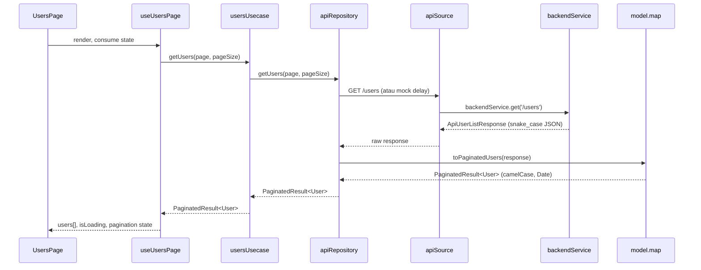
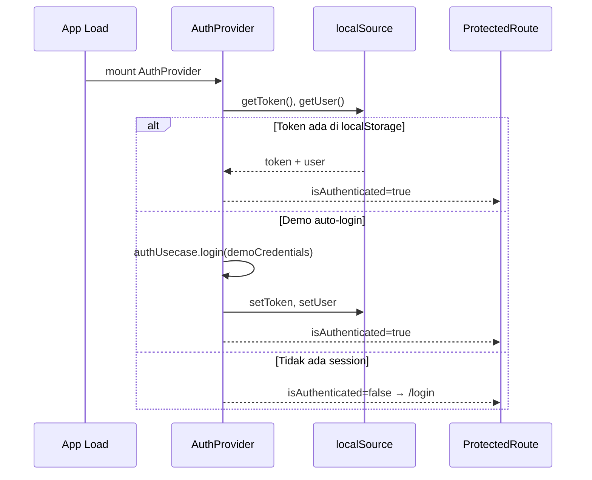

# React + TypeScript + Vite Application

**Production-ready React starter** dengan Vite, TypeScript, Tailwind CSS, dan **Clean Layered Architecture**.

**Live template preview:** [https://template.teristimewa.com/react-dashboard-template-01](https://template.teristimewa.com/react-dashboard-template-01)

<a href="https://template.teristimewa.com/react-dashboard-template-01">
  
</a>

Choose Language / Pilih Bahasa:

- [English](./README.md)
- Bahasa Indonesia (dokumen ini)

---

## ID: Bahasa Indonesia

### Daftar Isi

1. [Environment & Prasyarat Sistem (Multi-OS)](#1-environment--prasyarat-sistem-multi-os)
2. [Panduan Instalasi & Memulai Project (Step-by-Step)](#2-panduan-instalasi--memulai-project-step-by-step)
3. [Analisis Arsitektur & Justifikasi Teknologi](#3-analisis-arsitektur--justifikasi-teknologi)
4. [Cetak Biru Struktur Folder & Tata Kelola Kode](#4-cetak-biru-struktur-folder--tata-kelola-kode)
5. [Standar Pembuatan Komponen Baru & Siklus Kerja](#5-standar-pembuatan-komponen-baru--siklus-kerja)
6. [Sistem Routing & Proteksi Rute](#6-sistem-routing--proteksi-rute)
7. [Lapisan Data & Alur Request](#7-lapisan-data--alur-request)
8. [Internasionalisasi (i18n) & Tema](#8-internasionalisasi-i18n--tema)
9. [Katalog Komponen UI Reusable](#9-katalog-komponen-ui-reusable)
10. [Deployment & Konfigurasi Environment](#10-deployment--konfigurasi-environment)
11. [Makefile & Scaffolding](#11-makefile--scaffolding)
12. [Troubleshooting & FAQ](#12-troubleshooting--faq)

---

### 1. Environment & Prasyarat Sistem (Multi-OS)

#### 1.1 Filosofi Toolchain: Volta sebagai Single Source of Truth

Project ini **mengunci versi runtime dan package manager** menggunakan [**Volta**](https://volta.sh) demi konsistensi antar tim. Volta bekerja sebagai _version manager_ yang otomatis mengaktifkan versi Node.js dan pnpm yang tepat **setiap kali Anda masuk ke direktori project**, tanpa perlu `nvm use`, `fnm use`, atau konfigurasi manual lainnya.

Konfigurasi pin tercatat eksplisit di `package.json`:

```json
"volta": {
  "node": "20.11.0",
  "pnpm": "8.15.4"
}
```

| Tool         | Versi Terkunci | Peran dalam Project                                                  |
| ------------ | -------------- | -------------------------------------------------------------------- |
| **Node.js**  | `v20.11.0`     | Runtime JavaScript, eksekusi script build, dev server Vite           |
| **pnpm**     | `v8.15.4`      | Resolusi dependency, symlink `node_modules`, menjalankan npm scripts |
| **Git**      | versi terbaru  | Clone, branch, commit, scaffolding `make generate`                   |
| **GNU Make** | opsional       | Shortcut perintah development (`make dev`, `make build`, dll.)       |
| **rsync**    | opsional       | Hanya diperlukan untuk `make generate` / `generate-app.mjs`          |

#### 1.2 Instalasi Volta per Sistem Operasi

##### Windows

```powershell
# Opsi A: winget (disarankan)
winget install Volta.Volta

# Opsi B: installer manual
# Unduh dari https://volta.sh → jalankan installer → restart terminal
```

Setelah instalasi, buka **PowerShell baru** atau **Git Bash**, lalu:

```powershell
cd path\to\react-app
volta pin node@20.11.0
volta pin pnpm@8.15.4
node --version    # harus: v20.11.0
pnpm --version    # harus: 8.15.4
```

> **Catatan Windows:** Untuk `make generate` yang membutuhkan `rsync`, gunakan **WSL (Windows Subsystem for Linux)**. Native Windows tidak menyertakan `rsync` secara default.

##### macOS

```bash
# Opsi A: Homebrew (disarankan)
brew install volta

# Opsi B: curl script resmi
curl https://get.volta.sh | bash
```

Restart terminal, lalu:

```bash
cd ~/path/to/react-app
volta pin node@20.11.0
volta pin pnpm@8.15.4
```

Prasyarat tambahan macOS (untuk `make generate`):

```bash
xcode-select --install   # Git + make (Command Line Tools)
# rsync sudah termasuk di macOS, tidak perlu instalasi terpisah
```

##### Linux

```bash
# Instal Volta
curl https://get.volta.sh | bash

# Restart shell, lalu pin versi
volta pin node@20.11.0
volta pin pnpm@8.15.4
```

Debian/Ubuntu: prasyarat build tools:

```bash
sudo apt update
sudo apt install -y git build-essential rsync
```

Fedora/RHEL:

```bash
sudo dnf install -y git make rsync
```

Arch:

```bash
sudo pacman -S --needed git make rsync
```

#### 1.3 Verifikasi Lingkungan

Jalankan seluruh perintah berikut. Semua harus berhasil sebelum melanjutkan:

```bash
node --version          # v20.11.0
pnpm --version          # 8.15.4
git --version           # git version 2.x
volta --version         # 1.x (opsional tapi disarankan)
make --version          # opsional
rsync --version         # opsional (wajib untuk make generate)
```

#### 1.4 Catatan Penting Setelah Instalasi Volta

1. **Restart terminal** setelah instalasi Volta pertama kali; PATH belum ter-update sebelum restart.
2. Jalankan `volta pin node@20.11.0` dan `volta pin pnpm@8.15.4` jika:
   - Anda fork/clone repo tanpa blok `volta` di `package.json`
   - Versi yang aktif tidak sesuai saat `node --version`
3. **Jangan campur version manager**; hindari `nvm`, `fnm`, atau `asdf` bersamaan dengan Volta di project yang sama; konflik PATH dapat menyebabkan versi Node yang salah terpakai.
4. Makefile secara otomatis memprioritaskan Volta: `NODE := $(shell volta which node 2>/dev/null || command -v node)`.

---

### 2. Panduan Instalasi & Memulai Project (Step-by-Step)

#### 2.1 Langkah 1: Cloning Repository

```bash
git clone https://github.com/KutuGondrong/react-dashboard-template-01.git react-app
cd react-app
```

| Skenario              | Perintah                                                                          |
| --------------------- | --------------------------------------------------------------------------------- |
| Clone via SSH         | `git clone git@github.com:KutuGondrong/react-dashboard-template-01.git react-app` |
| Clone branch tertentu | `git clone -b <branch> <url>`                                                     |
| Update setelah clone  | `git pull origin main`                                                            |

#### 2.2 Langkah 2: Instalasi Dependency

```bash
pnpm install
```

**Mengapa pnpm (bukan npm/yarn)?**

| Aspek                     | Penjelasan                                                                                                                                                                  |
| ------------------------- | --------------------------------------------------------------------------------------------------------------------------------------------------------------------------- |
| **Efisiensi disk**        | pnpm menyimpan satu salinan setiap versi package di store global (`~/.pnpm-store`). Project hanya membuat hard link/symlink; tidak ada duplikasi ribuan file antar project. |
| **Kecepatan**             | Instalasi paralel dan deduplikasi agresif. Pada project dengan ratusan transitive dependency, `pnpm install` konsisten lebih cepat.                                         |
| **Determinisme**          | `pnpm-lock.yaml` mengunci dependency tree secara ketat. Cocok dengan filosofi Volta: **reproducible builds** di semua mesin developer.                                      |
| **Strict `node_modules`** | Package hanya bisa mengakses dependency yang dideklarasikan; mencegah _phantom dependency_ yang sering terjadi di npm.                                                      |

Struktur lock file:

```
pnpm-lock.yaml     → lock versi exact semua dependency (WAJIB di-commit)
package.json       → deklarasi dependency + volta pin
node_modules/      → symlink tree (jangan edit manual)
```

> Fallback `npm install` tetap berfungsi, namun project ini **diuji resmi hanya dengan pnpm 8.15.4**.

#### 2.3 Langkah 3: Development Mode

```bash
pnpm run dev
# setara: make dev
```

| Parameter         | Nilai                                                          |
| ----------------- | -------------------------------------------------------------- |
| Bundler           | Vite 5.4 + `@vitejs/plugin-react` 4.3                          |
| Mode              | `development` (`vite --mode development`)                      |
| Port              | `5173` (konfigurasi di `vite.config.ts`)                       |
| Auto-open browser | `true`                                                         |
| HMR               | Aktif; perubahan TSX/CSS langsung di browser tanpa full reload |
| Demo login        | `admin@mail.com` / `password123`                               |

Apa yang terjadi saat `pnpm run dev`:

```
1. Vite membaca vite.config.ts
2. loadEnv('development') → baca .env, .env.development, .env.local
3. Esbuild mentransform file .ts/.tsx ke ESM native
4. Dev server listen di :5173
5. Browser request → Vite serve module per-file (bukan bundle monolitik)
6. Perubahan file → HMR push ke browser via WebSocket
```

#### 2.4 Langkah 4: Code Quality Check

```bash
pnpm run lint
# setara: make lint
```

Pipeline lint **tidak menulis file apapun**; hanya validasi:

```
eslint src --ext .ts,.tsx
       ↓
  Aturan: eslint:recommended
          @typescript-eslint/recommended
          plugin:react/recommended
          plugin:react-hooks/recommended
       ↓
tsc --noEmit
       ↓
  Strict mode: noUnusedLocals, noUnusedParameters,
               noFallthroughCasesInSwitch, no-explicit-any
```

| Aturan ESLint Kunci                  | Efek                                        |
| ------------------------------------ | ------------------------------------------- |
| `@typescript-eslint/no-explicit-any` | `any` dilarang; wajib type eksplisit        |
| `@typescript-eslint/no-unused-vars`  | Variabel tidak terpakai = error             |
| `react-hooks/rules-of-hooks`         | Hooks hanya di top-level function component |
| `react/react-in-jsx-scope`           | Off (React 17+ JSX transform)               |

#### 2.5 Langkah 5: Auto-Formatting

```bash
pnpm run format
# setara: make format
```

Urutan eksekusi (berurutan, tidak paralel):

```
1. prettier --write "src/**/*.{ts,tsx,css,json}"
   ├── semi: true
   ├── singleQuote: true
   ├── trailingComma: 'all'
   ├── printWidth: 100
   └── plugin: prettier-plugin-tailwindcss (auto-sort class)

2. eslint src --ext .ts,.tsx --fix
   └── perbaiki masalah yang bisa di-auto-fix
```

**Contoh transformasi Tailwind class sort:**

```tsx
// Sebelum format
<div className="p-4 flex items-center bg-primary-500 text-white rounded-lg" />

// Sesudah format (urutan resmi Tailwind)
<div className="flex items-center rounded-lg bg-primary-500 p-4 text-white" />
```

#### 2.6 Langkah 6: Production Build

```bash
pnpm run build
# setara: make build (format dijalankan terlebih dahulu oleh Makefile)
```

```
┌─────────────────────────────────────────────────────────┐
│  FASE 1: Type-checking                                  │
│  tsc --noEmit                                           │
│  → Gagal = build BERHENTI (tidak ada dist/ dihasilkan)  │
├─────────────────────────────────────────────────────────┤
│  FASE 2: Vite Production Build                          │
│  vite build --mode production                           │
│  → Tree-shaking, minification, code-splitting           │
│  → Output: dist/                                        │
├─────────────────────────────────────────────────────────┤
│  FASE 3: Manual Chunks (vite.config.ts)                 │
│  vendor: react, react-dom, react-router-dom             │
│  axios: axios                                           │
│  → Optimal browser caching                              │
└─────────────────────────────────────────────────────────┘
```

Preview build production secara lokal:

```bash
pnpm run preview
# serve dist/ di port default Vite preview
```

#### 2.7 Tanpa Make: Alternatif Pnpm Murni

| Makefile               | Pnpm setara                                  |
| ---------------------- | -------------------------------------------- |
| `make dev`             | `pnpm run dev`                               |
| `make lint`            | `pnpm run lint`                              |
| `make format`          | `pnpm run format`                            |
| `make build`           | `pnpm run format && pnpm run build`          |
| `make preview`         | `pnpm run preview`                           |
| `make clean`           | `rm -rf dist .turbo node_modules/.vite`      |
| `make generate name=X` | `node scripts/generate-app.mjs --name=X`     |
| `make feature name=X`  | `node scripts/generate-feature.mjs --name=X` |

---

### 3. Analisis Arsitektur & Justifikasi Teknologi

#### 3.1 Stack Lengkap & Versi

| Kategori     | Package                                    | Versi                     | Peran                                    |
| ------------ | ------------------------------------------ | ------------------------- | ---------------------------------------- |
| UI Framework | `react` + `react-dom`                      | 18.3.1                    | Rendering, concurrent features, Suspense |
| Language     | `typescript`                               | 5.7.2                     | Static typing, strict mode               |
| Bundler      | `vite`                                     | 5.4.11                    | Dev server ESM + production Rollup       |
| React Plugin | `@vitejs/plugin-react`                     | 4.3.4                     | Fast Refresh, JSX transform              |
| Styling      | `tailwindcss`                              | 3.4.16                    | Utility-first CSS                        |
| CSS Pipeline | `postcss` + `autoprefixer`                 | 8.4 / 10.4                | Transform + vendor prefix                |
| HTTP Client  | `axios`                                    | 1.7.9                     | REST API dengan interceptors             |
| Routing      | `react-router-dom`                         | 6.28.0                    | SPA routing, nested layout, guards       |
| Linting      | `eslint` + `@typescript-eslint`            | 8.57 / 8.62               | Static analysis                          |
| Formatting   | `prettier` + `prettier-plugin-tailwindcss` | 3.4 / 0.6                 | Code style + Tailwind sort               |
| Runtime Pin  | `volta` (via package.json)                 | node 20.11.0, pnpm 8.15.4 | Toolchain consistency                    |

#### 3.2 React 18.3 + TypeScript 5.7 + Vite 5.4: Kombinasi Mutakhir

**React 18.3: mengapa bukan versi lebih lama?**

- **Concurrent Rendering**: React dapat menginterupsi, menunda, atau membatalkan render untuk menjaga UI responsif saat data berat dimuat.
- **Suspense untuk data fetching**: semua halaman di project ini di-`lazy()` import; `Suspense` boundary menampilkan `SkeletonLoader` saat chunk JS sedang diunduh.
- **`startTransition`**: RouterProvider dikonfigurasi dengan `future={{ v7_startTransition: true }}` untuk navigasi non-blocking.
- **StrictMode**: diaktifkan di `main.tsx` untuk mendeteksi side effect ganda saat development.

**TypeScript 5.7: strict mode penuh:**

```json
// tsconfig.json: aturan ketat yang WAJIB dipatuhi
"strict": true,
"noUnusedLocals": true,
"noUnusedParameters": true,
"noFallthroughCasesInSwitch": true
```

Implikasi praktis:

- Semua props komponen harus di-type (`interface` / `type`)
- `null` dan `undefined` ditangani eksplisit
- Import yang tidak terpakai = compile error
- `any` dilarang oleh ESLint (`@typescript-eslint/no-explicit-any: error`)

**Vite 5.4: mengapa bukan webpack/CRA?**

| Aspek                 | Vite                                 | Webpack (CRA)              |
| --------------------- | ------------------------------------ | -------------------------- |
| Cold start dev server | < 1 detik                            | 30–120 detik               |
| HMR latency           | < 50ms                               | 1–5 detik                  |
| Transform dev         | Esbuild (Go, native)                 | Babel (JS, interpreted)    |
| Production bundler    | Rollup                               | Webpack                    |
| Config complexity     | Minimal (`vite.config.ts` ~50 baris) | Sering butuh eject / craco |

#### 3.3 Tailwind CSS v3.4 & PostCSS

**Utility-first styling**: setiap class utilitas adalah building block atomik:

```tsx
// Satu elemen, styling lengkap tanpa file CSS terpisah
<button className="inline-flex items-center gap-2 rounded-lg bg-primary-600 px-4 py-2 text-sm font-medium text-white transition-colors hover:bg-primary-700 focus:outline-none focus:ring-2 focus:ring-primary-500 disabled:opacity-50" />
```

**Purging production**: hanya class yang muncul di file berikut yang masuk bundle CSS final:

```js
// tailwind.config.js
content: ['./index.html', './src/**/*.{js,ts,jsx,tsx}'];
```

**Dark mode**: custom variant untuk preview komponen dengan tema terisolasi:

```js
darkMode: ['variant', '.dark &:not(.theme-preview-light *)'];
```

Artinya: class `dark:*` aktif saat ancestor memiliki class `.dark`, kecuali di dalam `.theme-preview-light`.

**Global styles**: `src/index.css` mendefinisikan:

- Scrollbar styling (light/dark)
- `body` background (`bg-gray-50` / `dark:bg-gray-950`)
- Utility `.focus-ring`: focus ring konsisten memakai `ring-primary-500`
- Utility `.scrollbar-hide`
- Keyframe animasi chart

#### 3.4 Axios v1.7: HTTP Client Terpusat

**Mengapa Axios, bukan `fetch` bawaan?**

| Fitur              | `fetch`                    | Axios (`backendService`)                          |
| ------------------ | -------------------------- | ------------------------------------------------- |
| Interceptor global | Tidak ada (manual wrapper) | Request + Response interceptor built-in           |
| Auto JSON parse    | Manual `.json()`           | Otomatis                                          |
| Timeout            | `AbortSignal` manual       | `timeout: 30000` declarative                      |
| Error handling     | Hanya network error throw  | HTTP 4xx/5xx = rejected promise dengan `response` |
| Cancel request     | `AbortController`          | `CancelToken` / `AbortController`                 |
| Base URL           | Concat manual              | `baseURL: appConfig.apiBaseUrl`                   |
| Auth header inject | Manual setiap call         | Request interceptor otomatis                      |

**Arsitektur HTTP 3 lapis:**

```
backendService.ts     → Instance Axios + interceptors (infrastruktur)
       ↓
apiSource.ts          → Endpoint-level calls (/auth/login, /users)
       ↓
apiRepository.ts      → Business logic + mock data (development)
```

#### 3.5 React Router DOM v6.28

| Fitur          | Implementasi di Project                                          |
| -------------- | ---------------------------------------------------------------- |
| Router API     | `createBrowserRouter` (data router)                              |
| Nested layout  | `MainLayout` + `AuthLayout` dengan `<Outlet />`                  |
| Route guards   | `ProtectedRoute`, `PublicRoute`                                  |
| Code splitting | `React.lazy()` + `Suspense` per halaman                          |
| Basename       | `routerBasename` dari `import.meta.env.BASE_URL`                 |
| Auth shell     | `AuthShell` membungkus `AuthProvider` di luar layout             |
| 404 handling   | `path: '*'` → `NotFoundPage` (404 + tombol kembali ke dashboard) |

#### 3.6 ESLint v8 + Prettier v3: Standar Ketat

Konfigurasi di `.eslintrc.json` dan `.prettierrc` dirancang agar **seluruh tim menulis kode dengan gaya identik** tanpa diskusi formatting di code review.

**Prettier** menangani: indentasi, quote, trailing comma, line width, urutan class Tailwind.

**ESLint** menangani: logic error, React rules, TypeScript rules, unused variables.

**Prinsip:** Prettier untuk formatting, ESLint untuk correctness. Keduanya dijalankan berurutan via `pnpm run format`.

#### 3.7 Clean Layered Architecture: Diagram Lengkap

```
┌──────────────────────────────────────────────────────────────────────┐
│                        PRESENTATION LAYER                            │
│                                                                      │
│  features/*/pages/          Halaman screen (UsersPage, LoginPage)    │
│  features/*/components/     Komponen spesifik domain (UsersTable)    │
│  layouts/                   Shell aplikasi (Header, Sidebar, Footer)   │
│  components/                Shared UI library (Button, DataTable, …)   │
├──────────────────────────────────────────────────────────────────────┤
│                        APPLICATION LAYER                             │
│                                                                      │
│  features/*/hooks/          State & side effect per halaman          │
│  features/*/usecase/        Orkestrasi business logic                │
│  context/                   State global (Auth, Locale, Theme)       │
├──────────────────────────────────────────────────────────────────────┤
│                        DOMAIN / MODEL LAYER                          │
│                                                                      │
│  models/model.response.ts   Kontrak JSON mentah API (snake_case)     │
│  models/model.type.ts       Tipe UI (camelCase, Date objects)        │
│  models/model.map.ts        Anti-corruption mapper                   │
│  models/model.payload.ts    Tipe request body                        │
├──────────────────────────────────────────────────────────────────────┤
│                        INFRASTRUCTURE LAYER                          │
│                                                                      │
│  datasource/network/        HTTP (Axios) + repository + mock         │
│  datasource/local/          localStorage abstraction                 │
│  config/                    Konstanta, token warna, env config       │
│  router/                    Route definitions & guards               │
│  locales/                   File i18n JSON                           │
└──────────────────────────────────────────────────────────────────────┘
```

**Aturan dependensi antar layer (WAJIB):**

```
Presentation  →  boleh import Application, Domain, Infrastructure
Application   →  boleh import Domain, Infrastructure
Domain        →  TIDAK boleh import Presentation atau Application
Infrastructure →  boleh import Domain (types), config
```

#### 3.8 Alur Data End-to-End: Contoh Halaman Users



---

### 4. Cetak Biru Struktur Folder & Tata Kelola Kode

#### 4.1 Pohon Direktori `src/`: Lengkap

```
src/
├── config/
│   ├── app.config.ts              # Judul, locale, API URL, storage keys, flags
│   ├── color.tokens.ts            # ★ TOKEN WARNA: primary, accent, semantic
│   ├── basePath.ts                # routerBasename + assetUrl()
│   ├── externalLinks.ts           # Type-safe accessor external-links.json
│   ├── external-links.json        # Published documentation & component catalog URLs
│   └── devFeatures.ts             # Flag VITE_SHOW_DEV_FEATURES
│
├── context/
│   ├── AuthContext.tsx            # Session, login, logout, bootstrap
│   ├── LocaleContext.tsx          # i18n hook useLocale().t()
│   ├── ThemeContext.tsx           # light / dark / system
│   └── ScrollContext.tsx          # Scroll container ref untuk ScrollToTop
│
├── router/
│   ├── AppRouter.tsx              # createBrowserRouter: core routes + spread registries
│   ├── devLandingRoutes.tsx       # optional dev landing routes (Documentation, Components)
│   ├── featureRoutes.tsx          # manual feature routes (dashboard, users, …)
│   ├── featureRoutesGenerate.tsx  # generated routes (make feature — do not edit)
│   ├── RouteGuards.tsx            # ProtectedRoute, PublicRoute
│   └── AuthShell.tsx              # AuthProvider wrapper
│
├── locales/
│   ├── en.json                    # String UI bahasa Inggris
│   ├── id.json                    # String UI bahasa Indonesia
│   ├── messages.ts                # Loader + type-safe message registry
│   └── localeUtils.ts             # translateMessage(), interpolasi {{param}}
│
├── models/
│   ├── model.response.ts          # ApiUserResponse, ApiAuthResponse, …
│   ├── model.type.ts              # User, AuthSession, PaginatedResult, …
│   ├── model.map.ts               # toUser(), toAuthSession(), toPaginatedUsers()
│   └── model.payload.ts           # ModelPayload<T, Keys> untuk partial update
│
├── datasource/
│   ├── network/
│   │   ├── services/
│   │   │   └── backendService.ts  # ★ Instance Axios tunggal
│   │   ├── apiSource.ts           # login(), getUsers(), logout()
│   │   └── apiRepository.ts       # Mock auth + business validation
│   └── local/
│       └── localSource.ts         # Token, user, theme, locale di localStorage
│
├── components/                    # ★ Shared UI library (23+ komponen)
│   ├── AnimatedBackground/
│   ├── Avatar/
│   ├── Badge/
│   ├── Button/
│   ├── Card/
│   ├── Chart/                     # LineChart, BarChart, DonutChart
│   ├── CodeBlock/
│   ├── ComboBox/
│   ├── DataTable/                 # DataTable, DataTableGroup, StatusIcon
│   ├── DevFeatureBanner/
│   ├── Drawer/
│   ├── ErrorBoundary/
│   ├── FileManagement/            # Upload, download, hooks, utils
│   ├── Input/
│   ├── Layout/                    # Layout shell primitives + layoutUtils
│   ├── Modal/                     # Modal + ModalProvider
│   ├── NavMenu/
│   ├── Pagination/
│   ├── ScrollToTop/               # ScrollContainer, ScrollAnchor
│   ├── SkeletonLoader/
│   ├── Toast/                     # Toast + ToastProvider + positions
│   ├── Toggle/
│   ├── Typography/
│   └── locales/                   # components.common.* i18n defaults
│       ├── en.json
│       └── id.json
│
├── layouts/
│   ├── main-layout/
│   │   ├── components/
│   │   │   ├── MainLayout.tsx     # Dashboard shell (Header+Sidebar+Outlet)
│   │   │   ├── AuthLayout.tsx     # Login/register shell
│   │   │   ├── AuthLayoutCard.tsx
│   │   │   ├── AuthLayoutToolbar.tsx
│   │   │   └── AuthBrand.tsx
│   │   ├── hooks/useMainLayout.ts
│   │   └── layoutSurfaces.ts      # Token class permukaan layout
│   ├── header/
│   │   ├── components/            # Header, ProfileMenu, ThemeToggle, LocaleToggle
│   │   └── hooks/
│   ├── sidebar/
│   │   ├── featureMenuItems.tsx           # manual sidebar items (dashboard, users, …)
│   │   ├── featureMenuItemsGenerate.tsx   # generated menu (make feature — do not edit)
│   │   ├── devLandingMenuItems.tsx        # optional DEV menu items (Documentation, Components)
│   │   ├── components/            # Sidebar, MobileNavDrawer, SidebarIcons
│   │   └── hooks/useSidebar.ts    # menuItems dari config + buildFeatureMenuItems()
│   └── footer/
│
├── features/                      # ★ Domain modules
│   ├── auth/
│   │   ├── pages/                 # LoginPage, RegisterPage
│   │   ├── components/            # LoginForm, RegisterForm, AuthFormFooter
│   │   ├── hooks/useAuthForm.ts
│   │   └── usecase/authUsecase.ts
│   ├── dashboard/
│   │   ├── pages/DashboardPage.tsx
│   │   ├── components/DashboardStatsCards.tsx
│   │   ├── hooks/useDashboardPage.ts
│   │   └── usecase/dashboardUsecase.ts
│   ├── users/
│   │   ├── pages/UsersPage.tsx
│   │   ├── components/            # UsersTable, UserEditDrawer, UserDeleteDrawer
│   │   ├── hooks/useUsersPage.ts
│   │   └── usecase/usersUsecase.ts
│   ├── settings/
│   ├── tutorial/                  # Landing page → link docs publik (dev)
│   └── storybook/                 # Landing page → link katalog publik (dev)
│
├── utils/
│   └── scrollContainer.ts         # Pure scroll helper
│
├── App.tsx                        # Provider tree root
├── main.tsx                       # createRoot entry point
├── index.css                      # Tailwind directives + global CSS
└── vite-env.d.ts                  # ImportMetaEnv types
```

#### 4.2 Direktori `public/`: Aset Statis

```
public/
├── logo-light.svg                 # Logo tema terang
├── logo-dark.svg                  # Logo tema gelap
└── samples/
    ├── data.csv                   # Sample download FileManagement
    ├── report.pdf
    └── readme.txt
```

Akses via helper `assetUrl()`:

```tsx
import { assetUrl } from '@/config/basePath';
;
// Hasil: /logo-light.svg (atau /subpath/logo-light.svg jika VITE_BASE_PATH diset)
```

> Project ini **tidak memakai `src/assets/`**. Semua aset statis di `public/` agar tidak melalui bundler: cocok untuk file yang perlu URL absolut atau diakses dari luar React.

#### 4.3 Aturan Tata Kelola per Folder

##### `src/config/`: Konstanta & Design Tokens

| File                  | Isi                                                  | Larangan                        |
| --------------------- | ---------------------------------------------------- | ------------------------------- |
| `app.config.ts`       | `title`, `apiBaseUrl`, `defaultLocale`, storage keys | Jangan hardcode di komponen     |
| `color.tokens.ts`     | Palet warna primary, accent, semantic                | Jangan pakai hex di JSX         |
| `basePath.ts`         | `routerBasename`, `assetUrl()`                       | Jangan construct URL manual     |
| `external-links.json` | URL publik tutorial & katalog komponen               | Jangan hardcode URL di komponen |

##### `src/context/`: State Global React

Satu concern per context. Setiap context **wajib** mengekspor custom hook:

| Context         | Hook          | State yang Dikelola                         |
| --------------- | ------------- | ------------------------------------------- |
| `AuthContext`   | `useAuth()`   | user, token, login, logout, isBootstrapping |
| `LocaleContext` | `useLocale()` | locale, setLocale, t(key, params)           |
| `ThemeContext`  | `useTheme()`  | mode, resolvedTheme, setMode, toggleTheme   |
| `ScrollContext` | `useScroll()` | scroll container ref                        |

##### `src/models/`: Anti-Corruption Layer

Pemisahan ketat antara kontrak API dan tipe UI:

```typescript
// model.response.ts: APA ADANYA dari API (snake_case, string dates)
interface ApiUserResponse {
  full_name: string;
  created_at: string; // ISO string
  is_active: boolean;
}

// model.type.ts: OPTIMAL untuk UI (camelCase, Date objects)
interface User {
  fullName: string;
  createdAt: Date;
  isActive: boolean;
}

// model.map.ts: JEMBATAN transformasi
function toUser(api: ApiUserResponse): User {
  return {
    fullName: api.full_name,
    createdAt: new Date(api.created_at),
    isActive: api.is_active,
    // ...
  };
}
```

**Mengapa layer ini penting?**

- Backend bisa ganti field name tanpa merusak seluruh UI; cukup update mapper.
- UI tidak perlu tahu format snake_case API.
- Type safety terjaga di kedua sisi kontrak.

##### `src/datasource/`: Satu-satunya Gerbang Data

| Larangan                                      | Alasan                                    |
| --------------------------------------------- | ----------------------------------------- |
| `import axios from 'axios'` di komponen/hook  | Semua HTTP harus melalui `backendService` |
| `localStorage.setItem()` langsung di komponen | Gunakan `localSource` abstraction         |
| `fetch()` untuk API calls                     | Gunakan `apiSource` / `apiRepository`     |

##### `src/components/`: Shared UI tanpa Business Logic

- **Satu folder per komponen** dengan `index.ts` barrel export.
- **Tidak boleh** import dari `features/`; arah dependensi: feature → component, bukan sebaliknya.
- String default komponen dari `src/components/locales/` namespace `components.common.*`.
- Props opsional yang punya default text → fallback ke `t('components.common.xxx')`.

##### `src/layouts/`: Shell Aplikasi

Layout hanya mengatur **struktur visual**; tidak berisi fetch data atau business rule.

| Layout       | Route                     | Fungsi                                   |
| ------------ | ------------------------- | ---------------------------------------- |
| `MainLayout` | `/dashboard`, `/users`, … | Header + Sidebar + Footer + `<Outlet />` |
| `AuthLayout` | `/login`, `/register`     | Card centered, branding, toolbar         |

##### `src/features/`: Modul Domain Terisolasi

Setiap feature adalah **bounded context** mandiri:

```
features/<nama>/
├── pages/           # Screen yang di-map ke React Router
├── components/      # UI khusus domain ini saja
├── hooks/           # State management halaman
└── usecase/         # Orkestrasi business logic → datasource
```

**Feature tidak boleh import dari feature lain secara langsung.** Jika ada kebutuhan shared, ekstrak ke `components/`, `context/`, atau `utils/`.

#### 4.4 ★ Sistem Token Warna: Bagian Krusial

##### Sumber Kebenaran Ganda (Wajib Sinkron)

| File                                         | Konsumen                                     | Kapan Dipakai                       |
| -------------------------------------------- | -------------------------------------------- | ----------------------------------- |
| `src/config/color.tokens.ts`                 | Chart SVG, programmatic color, runtime logic | `resolveChartColor('primary')`      |
| `tailwind.config.js` → `theme.extend.colors` | Semua class Tailwind di JSX                  | `bg-primary-500`, `text-accent-600` |

##### Palet Lengkap

**Primary (Brand: Indigo)**

| Token               | Hex            | Penggunaan Umum          |
| ------------------- | -------------- | ------------------------ |
| `primary-50`        | `#eef2ff`      | Background subtle        |
| `primary-100`–`300` | gradasi terang | Hover state ringan       |
| `primary-400`       | `#818cf8`      | Chart light variant      |
| `primary-500`       | `#6366f1`      | Default brand color      |
| `primary-600`       | `#4f46e5`      | Button primary default   |
| `primary-700`–`950` | gradasi gelap  | Text on light, dark mode |

**Accent (Secondary: Amber)**

| Token        | Hex       | Penggunaan Umum         |
| ------------ | --------- | ----------------------- |
| `accent-500` | `#f59e0b` | Highlight, badge accent |
| `accent-600` | `#d97706` | Hover accent            |

**Semantic Colors**

| Kategori | Token                 | Hex (500) | Penggunaan                 |
| -------- | --------------------- | --------- | -------------------------- |
| Success  | `success-400/500/600` | `#22c55e` | Status aktif, toast sukses |
| Danger   | `danger-400/500/600`  | `#ef4444` | Error, delete, toast error |
| Info     | `info-400/500/600`    | `#3b82f6` | Informasi, tooltip         |

**Surface**

| Token           | Hex       | Penggunaan                 |
| --------------- | --------- | -------------------------- |
| `surface-light` | `#ffffff` | Card background light mode |
| `surface-dark`  | `#0f172a` | Card background dark mode  |

##### Aturan Keras: Contoh Lengkap

```tsx
// ❌ DILARANG KERAS: hardcoded hex di komponen
<div style={{ backgroundColor: '#6366f1' }} />
<div className="bg-[#6366f1]" />
<svg fill="#4f46e5" />

// ❌ DILARANG: warna Tailwind bawaan untuk brand (inkonsisten dengan design system)
<button className="bg-indigo-600" />   // pakai primary-600
<span className="text-blue-500" />     // pakai info-500 jika semantic info

// ✅ BENAR: token Tailwind dari design system
<button className="bg-primary-600 hover:bg-primary-700" />
<span className="text-success-500" />
<div className="border-danger-500 bg-danger-50" />

// ✅ BENAR: runtime color untuk SVG chart
import { resolveChartColor, type ChartColorToken } from '@/config/color.tokens';
const color = resolveChartColor('primary');  // → '#6366f1'
<circle fill={color} />

// ✅ BENAR: semantic surface
<div className="bg-surface-light dark:bg-surface-dark" />
```

##### Prosedur Menambah Warna Baru

1. Tambahkan token di `src/config/color.tokens.ts`
2. Tambahkan token yang **identik** di `tailwind.config.js` → `theme.extend.colors`
3. Jalankan `pnpm run format`
4. Gunakan class Tailwind baru di komponen
5. **Jangan** commit jika hanya satu file yang diupdate; keduanya WAJIB sinkron

#### 4.5 Provider Tree & Boot Sequence

```
main.tsx
  └── <StrictMode>
        └── <App>
              └── <ErrorBoundary>           ← tangkap crash React tree
                    └── <LocaleProvider>    ← i18n (paling luar: error screen juga terlokalisasi)
                          └── <ThemeProvider>     ← class .dark di <html>
                                └── <ToastProvider>     ← global toast queue
                                      └── <ModalProvider>   ← global modal stack
                                            └── <RouterProvider>
                                                  └── <AuthShell>
                                                        └── <AuthProvider>  ← session bootstrap
                                                              └── <Outlet />  ← layout routes
```

---

### 5. Standar Pembuatan Komponen Baru & Siklus Kerja

#### 5.1 Konvensi Penamaan File

| Jenis File       | Konvensi                        | Ekstensi | Contoh                                      |
| ---------------- | ------------------------------- | -------- | ------------------------------------------- |
| Komponen React   | **PascalCase**                  | `.tsx`   | `ButtonPrimary.tsx`, `UserEditDrawer.tsx`   |
| Custom hooks     | **camelCase** + prefix `use`    | `.ts`    | `useAuthForm.ts`, `useUsersPage.ts`         |
| Usecase          | **camelCase**                   | `.ts`    | `usersUsecase.ts`                           |
| Utils/helpers    | **camelCase**                   | `.ts`    | `scrollContainer.ts`, `tableColumnUtils.ts` |
| Types            | **camelCase** atau `*.types.ts` | `.ts`    | `chart.types.ts`, `comboBox.types.ts`       |
| Config/constants | **camelCase**                   | `.ts`    | `app.config.ts`, `color.tokens.ts`          |
| Locale JSON      | **kebab atau nested**           | `.json`  | `en.json`, `id.json`                        |
| Barrel export    | `index.ts`                      | `.ts`    | `components/Button/index.ts`                |

#### 5.2 Anatomi Folder Komponen Baru

```
src/components/MyComponent/
├── MyComponent.tsx           # Implementasi utama: export function MyComponent
├── myComponent.types.ts      # (opsional) Props interface, variant types
├── myComponent.utils.ts      # (opsional) Pure helpers: TIDAK boleh panggil useLocale
├── index.ts                  # export { MyComponent } from './MyComponent'
└── locales/                  # (opsional) jika komponen punya default text
    ├── en.json               # { "components": { "common": { "myKey": "..." } } }
    └── id.json
```

**`index.ts` barrel export:**

```typescript
export { MyComponent } from './MyComponent';
export type { MyComponentProps } from './myComponent.types';
```

#### 5.3 Template Komponen Baru: Contoh Lengkap

```tsx
// src/components/StatusTag/StatusTag.tsx
import { useLocale } from '@/context/LocaleContext';

export type StatusTagVariant = 'success' | 'danger' | 'info' | 'neutral';

export interface StatusTagProps {
  variant? StatusTagVariant;
  label? string;
  className? string;
}

const variantClasses: Record<StatusTagVariant, string> = {
  success: 'bg-success-500/10 text-success-600 dark:text-success-400',
  danger: 'bg-danger-500/10 text-danger-600 dark:text-danger-400',
  info: 'bg-info-500/10 text-info-600 dark:text-info-400',
  neutral: 'bg-gray-100 text-gray-600 dark:bg-gray-800 dark:text-gray-400',
};

export function StatusTag({
  variant = 'neutral',
  label,
  className = '',
}: StatusTagProps) {
  const { t } = useLocale();
  const resolvedLabel = label ?? t('components.common.status');

  return (
    <span
      className={`inline-flex items-center rounded-full px-2.5 py-0.5 text-xs font-medium ${variantClasses[variant]} ${className}`}
    >
      {resolvedLabel}
    </span>
  );
}
```

Checklist yang dipenuhi template di atas:

- ✅ PascalCase nama file dan function
- ✅ Props di-type dengan `interface`
- ✅ Warna dari token Tailwind (`success-*`, `danger-*`); bukan hex
- ✅ Default text dari locale (`t('components.common.status')`)
- ✅ `className` prop untuk override styling dari parent
- ✅ Dark mode variant untuk setiap status

#### 5.4 Standar Feature Baru: Contoh Lengkap

```
src/features/inventory/
├── pages/
│   └── InventoryPage.tsx       # Screen utama: hanya compose hook + components
├── components/
│   └── InventoryTable.tsx      # Tabel spesifik domain
├── hooks/
│   └── useInventoryPage.ts     # State, fetch, pagination, selection
└── usecase/
    └── inventoryUsecase.ts     # Panggil apiRepository, tidak ada JSX
```

**`inventoryUsecase.ts`:**

```typescript
import { apiRepository } from '@/datasource/network/apiRepository';

export const inventoryUsecase = {
  async getItems(page: number, pageSize: number) {
    return apiRepository.getInventory(page, pageSize);
  },
};
```

**`useInventoryPage.ts`:**

```typescript
import { useCallback, useEffect, useState } from 'react';
import { inventoryUsecase } from '@/features/inventory/usecase/inventoryUsecase';

export function useInventoryPage() {
  const [items, setItems] = useState([]);
  const [isLoading, setIsLoading] = useState(true);

  const fetchItems = useCallback(async () => {
    setIsLoading(true);
    try {
      const result = await inventoryUsecase.getItems(1, 10);
      setItems(result.data);
    } finally {
      setIsLoading(false);
    }
  }, []);

  useEffect(() => {
    void fetchItems();
  }, [fetchItems]);

  return { items, isLoading, refetch: fetchItems };
}
```

#### 5.5 Checklist Pre-Commit (Wajib)

```bash
# 1. Format seluruh kode
pnpm run format

# 2. Validasi: HARUS zero error, zero warning
pnpm run lint

# 3. (Opsional tapi disarankan) Pastikan build sukses
pnpm run build
```

| Kriteria                             | Status yang Diharapkan |
| ------------------------------------ | ---------------------- |
| ESLint errors                        | **0**                  |
| ESLint warnings                      | **0**                  |
| TypeScript errors                    | **0**                  |
| Prettier diff setelah format         | **0** (sudah bersih)   |
| Hardcoded hex colors                 | **0**                  |
| `any` type                           | **0**                  |
| String UI hardcoded di `components/` | **0**                  |

#### 5.6 Anti-Patterns: Yang Dilarang

| Anti-Pattern                                       | Mengapa Salah                   | Solusi Benar                             |
| -------------------------------------------------- | ------------------------------- | ---------------------------------------- |
| `axios.get()` di komponen                          | Bypass interceptor & mock layer | `usecase` → `apiRepository`              |
| `localStorage.setItem('token')` di hook            | Key tidak terpusat              | `localSource.setToken()`                 |
| `full_name` di UI component                        | API leak ke presentation        | `toUser()` mapper → `fullName`           |
| Business logic di `components/`                    | Tidak reusable, sulit di-test   | Pindah ke `usecase/` atau `hooks/`       |
| Import `features/users/` dari `features/products/` | Coupling antar domain           | Ekstrak ke `components/` atau `context/` |
| `bg-[#hex]` di className                           | Di luar design system           | Token Tailwind                           |
| Skip `pnpm run format` sebelum commit              | CI gagal, review noise          | Selalu format dulu                       |

#### 5.7 Path Alias

```tsx
// ✅ Gunakan alias @/
import { Button } from '@/components/Button';
import { appConfig } from '@/config/app.config';
import { useAuth } from '@/context/AuthContext';
import { usersUsecase } from '@/features/users/usecase/usersUsecase';

// ❌ Hindari relative path dalam
import { Button } from '../../../components/Button';
```

Konfigurasi di dua tempat (keduanya wajib sinkron):

```json
// tsconfig.json
"paths": { "@/*": ["src/*"] }
```

```typescript
// vite.config.ts
resolve: { alias: { '@': path.resolve(__dirname, './src') } }
```

---

### 6. Sistem Routing & Proteksi Rute

#### 6.1 Peta Route Lengkap

| Path               | Layout     | Guard     | Halaman                     | Lazy |
| ------------------ | ---------- | --------- | --------------------------- | ---- |
| `/`                | MainLayout | Protected | Redirect → `/dashboard`     | -    |
| `/dashboard`       | MainLayout | Protected | DashboardPage               | ✅   |
| `/users`           | MainLayout | Protected | UsersPage                   | ✅   |
| `/settings`        | MainLayout | Protected | SettingsPage                | ✅   |
| `/login`           | AuthLayout | Public    | LoginPage                   | ✅   |
| `/register`        | AuthLayout | Public    | RegisterPage                | ✅   |
| `/documentation/*` | MainLayout | Protected | Documentation landing (dev) | ✅   |
| `/components/*`    | MainLayout | Protected | Components landing (dev)    | ✅   |
| `*`                | MainLayout | Protected | NotFoundPage (404)          | ✅   |

#### 6.2 Route Guards: Implementasi

**`ProtectedRoute`**: wajib autentikasi:

```
User akses /users
  → isBootstrapping? → tampilkan SkeletonLoader
  → !isAuthenticated? → redirect /login (simpan location di state)
  → authenticated → render children (MainLayout)
```

**`PublicRoute`**: hanya untuk guest:

```
User akses /login
  → isBootstrapping? → tampilkan SkeletonLoader
  → isAuthenticated? → redirect /dashboard
  → guest → render children (AuthLayout)
```

#### 6.3 Lazy Loading & Code Splitting

Semua halaman menggunakan pola identik:

```tsx
const UsersPage = lazy(() => import('@/features/users/pages/UsersPage'));

function LazyPage({ children }: { children: React.ReactNode }) {
  return <Suspense fallback={<SkeletonLoader />}>{children}</Suspense>;
}
```

Setiap route = chunk JS terpisah. Browser hanya mengunduh kode halaman yang dikunjungi.

#### 6.4 Auth Bootstrap Flow



---

### 7. Lapisan Data & Alur Request

#### 7.1 Tiga Lapis Network

| Lapis          | File                | Tanggung Jawab                                    |
| -------------- | ------------------- | ------------------------------------------------- |
| **Transport**  | `backendService.ts` | Axios instance, base URL, timeout, interceptors   |
| **Endpoint**   | `apiSource.ts`      | Mapping 1:1 ke REST endpoint (`POST /auth/login`) |
| **Repository** | `apiRepository.ts`  | Business validation, mock data, panggil mapper    |

#### 7.2 `backendService`: Interceptor Detail

**Request interceptor:**

```typescript
// Otomatis inject Bearer token dari localStorage
const token = localSource.getToken();
if (token) config.headers.Authorization = `Bearer ${token}`;
```

**Response interceptor:**

```typescript
// HTTP 401 → clear session → trigger unauthorized handler
if (error.response?.status === 401) {
  localSource.clearAuth();
  onUnauthorized(); // → navigate('/login')
}
```

#### 7.3 `localSource`: Abstraksi localStorage

| Method                                      | Key (dari app.config) | Tipe                            |
| ------------------------------------------- | --------------------- | ------------------------------- |
| `getToken()` / `setToken()`                 | `auth_token`          | `string`                        |
| `getUser()` / `setUser()`                   | `auth_user`           | `User` (JSON serialized)        |
| `getTheme()` / `setTheme()`                 | `app_theme`           | `'light' \| 'dark' \| 'system'` |
| `getLocale()` / `setLocale()`               | `app_locale`          | `'en' \| 'id'`                  |
| `getToastPosition()` / `setToastPosition()` | `app_toast_position`  | `ToastPosition`                 |
| `clearAuth()`                               | hapus token + user    | -                               |

Semua operasi localStorage dibungkus `safeGetItem` / `safeSetItem`: tidak crash di private browsing atau saat quota penuh.

#### 7.4 Mock Auth (Development)

| Kredential                       | Peran                               |
| -------------------------------- | ----------------------------------- |
| `admin@mail.com` / `password123` | Akun demo admin                     |
| Token                            | `mock_jwt_token_admin_session_2024` |
| Delay simulasi                   | 800ms per request                   |

Mock ada di `apiRepository.ts`: saat backend nyata tersedia, cukup ganti implementasi repository tanpa mengubah usecase atau UI.

---

### 8. Internasionalisasi (i18n) & Tema

#### 8.1 Sistem i18n

**Bahasa yang didukung:** `en` (English), `id` (Bahasa Indonesia)

**File locale:**

| File                                         | Scope                                       |
| -------------------------------------------- | ------------------------------------------- |
| `src/locales/en.json` + `id.json`            | String UI global (nav, error, halaman)      |
| `src/components/locales/en.json` + `id.json` | Default text komponen shared                |
| `src/features/*/locales/`                    | String khusus feature (tutorial, storybook) |

**Penggunaan:**

```tsx
import { useLocale } from '@/context/LocaleContext';

function UsersPage() {
  const { t, locale, setLocale } = useLocale();

  return (
    <div>
      <h1>{t('users.title')}</h1>
      <p>{t('users.deleteMessage', { name: 'John Doe' })}</p>
      <button onClick={() => setLocale('id')}>ID</button>
    </div>
  );
}
```

**Format JSON locale:**

```json
// en.json
{
  "users": {
    "title": "Users",
    "deleteMessage": "Are you sure you want to delete {{name}}?"
  },
  "nav": {
    "dashboard": "Dashboard",
    "users": "Users"
  }
}

// id.json: key HARUS identik, urutan kata boleh berbeda
{
  "users": {
    "title": "Pengguna",
    "deleteMessage": "Apakah Anda yakin ingin menghapus {{name}}?"
  },
  "nav": {
    "dashboard": "Dasbor",
    "users": "Pengguna"
  }
}
```

**Aturan:**

- Parameter interpolasi `{{param}}`: nama param **harus sama** di en dan id.
- `defaultLocale` di `app.config.ts` (default: `'en'`).
- Locale persisten di localStorage via `localSource`.

#### 8.2 Sistem Tema

| Mode     | Perilaku                                          |
| -------- | ------------------------------------------------- |
| `light`  | Force light mode                                  |
| `dark`   | Force dark mode: tambah class `.dark` di `<html>` |
| `system` | Ikuti `prefers-color-scheme` OS                   |

```tsx
import { useTheme } from '@/context/ThemeContext';

const { mode, resolvedTheme, setMode, toggleTheme } = useTheme();
// mode: preferensi user ('light' | 'dark' | 'system')
// resolvedTheme: tema aktif setelah resolve ('light' | 'dark')
```

Persisten di localStorage (`app_theme`). `ThemeToggleButton` di header memanggil `toggleTheme()`.

---

### 9. Katalog Komponen UI Reusable

Semua komponen di `src/components/` dibangun dengan Tailwind CSS dan token warna design system.

| Komponen               | Folder                | Fungsi Utama                                                                          |
| ---------------------- | --------------------- | ------------------------------------------------------------------------------------- |
| **Button**             | `Button/`             | Variant: primary, secondary, outline, ghost, danger. Size: sm, md, lg. Loading state. |
| **Input**              | `Input/`              | Text input dengan label, error, helper text                                           |
| **ComboBox**           | `ComboBox/`           | Select searchable dengan keyboard navigation                                          |
| **DataTable**          | `DataTable/`          | Tabel generik dengan sort, selection, grouping, status icon                           |
| **Pagination**         | `Pagination/`         | Navigasi halaman dengan page size selector                                            |
| **Modal**              | `Modal/`              | Dialog + `ModalProvider` global stack                                                 |
| **Drawer**             | `Drawer/`             | Panel slide dari kiri/kanan                                                           |
| **Toast**              | `Toast/`              | Notifikasi dengan 5 tipe, 7 posisi, auto-dismiss                                      |
| **Badge**              | `Badge/`              | Label status dengan variant warna                                                     |
| **Card**               | `Card/`               | Container dengan header, body, footer                                                 |
| **Avatar**             | `Avatar/`             | Gambar profil dengan fallback inisial                                                 |
| **Toggle**             | `Toggle/`             | Switch on/off                                                                         |
| **Typography**         | `Typography/`         | Heading, text, label konsisten                                                        |
| **Chart**              | `Chart/`              | LineChart, BarChart, DonutChart dengan animasi                                        |
| **FileManagement**     | `FileManagement/`     | Upload, download, progress, drag & drop                                               |
| **Layout**             | `Layout/`             | Primitif Header, Sider, Footer, Content                                               |
| **NavMenu**            | `NavMenu/`            | Menu navigasi sidebar dengan tree connector                                           |
| **SkeletonLoader**     | `SkeletonLoader/`     | Placeholder loading animasi shimmer                                                   |
| **ErrorBoundary**      | `ErrorBoundary/`      | Tangkap error React + recovery screen terlokalisasi                                   |
| **ScrollToTop**        | `ScrollToTop/`        | Scroll container + anchor navigation                                                  |
| **CodeBlock**          | `CodeBlock/`          | Syntax display dengan copy button                                                     |
| **AnimatedBackground** | `AnimatedBackground/` | Background animasi untuk layout                                                       |
| **DevFeatureBanner**   | `DevFeatureBanner/`   | Banner mode DEV untuk fitur pengembangan                                              |

Saat `pnpm run dev`, menu **Dokumentasi** dan **Components** _(badge DEV)_ membuka landing page dengan tautan ke dokumentasi dan katalog komponen yang dipublish (`external-links.json`). Set `VITE_SHOW_DEV_FEATURES=false` untuk menyembunyikan menu tersebut.

### 10. Deployment & Konfigurasi Environment

#### 10.1 Environment Variables

| Variable                 | File               | Default | Fungsi                                                                                  |
| ------------------------ | ------------------ | ------- | --------------------------------------------------------------------------------------- |
| `VITE_API_BASE_URL`      | `.env`             | `/api`  | Base URL backend API                                                                    |
| `VITE_BASE_PATH`         | `.env.production`  | `/`     | Subpath deploy (mis. `/react-dashboard-template-01/`)                                   |
| `VITE_SHOW_DEV_FEATURES` | `.env.development` | `true`  | Tampilkan menu landing Dokumentasi & Components saat dev. Set `false` untuk sembunyikan |

Set `previewUrl` di `src/config/external-links.json` (atau `VITE_OG_SITE_URL` di `.env.production`) ke URL deploy agar preview link memakai `public/og-image.jpg`.

#### 10.2 Deploy di Subpath

Jika aplikasi di-host di subpath (bukan root domain), set `VITE_BASE_PATH` sebelum build:

```bash
# .env.production
VITE_BASE_PATH=/my-app/
```

```bash
pnpm run build
pnpm run preview   # opsional, cek dist/ secara lokal
```

**Penting:**

- `VITE_BASE_PATH` harus sama dengan path hosting Anda.
- `assetUrl()` dan `routerBasename` otomatis resolve dari `import.meta.env.BASE_URL`.
- Deep link (mis. `/dashboard`) membutuhkan **SPA fallback** di web server: tanpa itu, refresh di URL dalam aplikasi bisa menampilkan halaman kosong atau 404. Ikuti dokumentasi provider hosting Anda.

Penjelasan lebih lengkap: [DOCUMENTATION.id.md](./DOCUMENTATION.id.md).

---

### 11. Makefile & Scaffolding

#### 11.1 Semua Target Makefile

| Target                 | Perintah Internal                       | Deskripsi                       |
| ---------------------- | --------------------------------------- | ------------------------------- |
| `make dev`             | `pnpm run dev`                          | Dev server port 5173            |
| `make format`          | `pnpm run format`                       | Prettier + ESLint fix           |
| `make lint`            | `pnpm run lint`                         | ESLint + tsc (no write)         |
| `make build`           | `format` → `pnpm run build`             | Production build                |
| `make preview`         | `pnpm run preview`                      | Serve dist/ lokal               |
| `make clean`           | `rm -rf dist .turbo node_modules/.vite` | Bersihkan artefak build         |
| `make generate name=X` | `node scripts/generate-app.mjs`         | Scaffold micro-app di luar repo |
| `make feature name=X`  | `node scripts/generate-feature.mjs`     | Tambah menu + halaman feature   |

#### 11.2 Scaffold Feature

```bash
make feature name=reports label="Reports" label-id="Laporan"
make feature name=inventory scope=hook label="Inventory" label-id="Inventaris"
make feature name=analytics scope=page label="Analytics" label-id="Analitik"
```

| Parameter  | Wajib?           | Deskripsi                                                                                                                                                                                                                       |
| ---------- | ---------------- | ------------------------------------------------------------------------------------------------------------------------------------------------------------------------------------------------------------------------------- |
| `name`     | ✅               | Nama fitur — boleh pakai spasi (mis. `name="pake spasi"`). Perintah mempertahankan input; key jadi camelCase (`pake spasi` → `pakeSpasi`). Spasi/pemisah berlebih di-trim/digabung. Key sudah ada? Perintah gagal — ganti nama. |
| `label`    | Direkomendasikan | Label menu bahasa Inggris (boleh spasi, pakai tanda kutip)                                                                                                                                                                      |
| `label-id` | Direkomendasikan | Label menu bahasa Indonesia (boleh spasi, pakai tanda kutip)                                                                                                                                                                    |
| `scope`    | Opsional         | `full` (default), `hook`, `page`                                                                                                                                                                                                |

| Scope  | File Dihasilkan               | Mock Data      |
| ------ | ----------------------------- | -------------- |
| `full` | page + table + hook + usecase | `usecase/*.ts` |
| `hook` | page + table + hook           | inline di hook |
| `page` | page saja                     | tidak ada      |

**Aturan nama:**

| Perintah        | Contoh input | Perintah disalin                  | Hasil (key/folder)                                      |
| --------------- | ------------ | --------------------------------- | ------------------------------------------------------- |
| `make feature`  | `pake spasi` | `make feature name="pake spasi"`  | Key **`pakeSpasi`** (camelCase) — folder, route, locale |
| `make generate` | `my new app` | `make generate name="my new app"` | Folder **`my-new-app`** (kebab-case, path output saja)  |

Spasi/pemisah berlebih di-trim/digabung saat menghitung key atau folder.

Yang di-generate otomatis (`make feature` — jangan edit manual):

- Folder `src/features/<name>/`
- Route di `src/router/featureRoutesGenerate.tsx`
- Menu item di `src/layouts/sidebar/featureMenuItemsGenerate.tsx`
- Locale keys di `en.json` + `id.json`
- Ikon sidebar default (`FeatureMenuIcon` di file generate)

Halaman **Dokumentasi → Tutorial** punya builder perintah interaktif: mempertahankan input `name`/`app name` Anda (termasuk spasi) di perintah yang disalin, dan menampilkan preview feature key atau folder output — input tidak diubah otomatis saat mengetik.

Registry manual (edit sendiri jika wiring tanpa generator):

- Route bawaan di `src/router/featureRoutes.tsx` (dashboard, users, …)
- Menu bawaan di `src/layouts/sidebar/featureMenuItems.tsx`
- Route `settings` tetap di `AppRouter.tsx` (paling akhir)

#### 11.3 Scaffold Micro-App

```bash
make generate name=my-new-app
make generate name=my-new-app out=~/projects/my-new-app
```

Hasil:

- Copy seluruh template ke direktori luar repo
- Update `package.json` name
- `git init` di folder baru
- Siap `pnpm install && make dev`

**Aturan nama folder:** spasi di `name` tetap di perintah (mis. `name="my new app"`); folder output memakai kebab-case (`my-new-app`); spasi/pemisah berlebih di-trim/digabung. Hanya untuk path folder output, bukan locale key. Halaman **Dokumentasi → Tutorial** menampilkan preview folder saat Anda mengetik.

---

### 12. Troubleshooting & FAQ

#### `node_modules not found` saat `make dev`

```bash
pnpm install
make dev
```

#### Versi Node salah (`v18.x` atau `v22.x`)

```bash
volta pin node@20.11.0
volta pin pnpm@8.15.4
# restart terminal
node --version  # harus v20.11.0
```

#### `pnpm: command not found`

```bash
volta install pnpm@8.15.4
# atau: npm install -g pnpm@8.15.4
```

#### ESLint error `no-explicit-any`

Ganti `any` dengan tipe spesifik atau `unknown` + type guard.

#### Build gagal di `tsc --noEmit`

```bash
pnpm run lint   # lihat error TypeScript detail
# Perbaiki: unused imports, missing types, strict null checks
```

#### Halaman blank setelah deploy di subpath

- Pastikan `VITE_BASE_PATH` di build sama dengan path hosting
- Aktifkan SPA fallback di web server / provider hosting Anda
- Cek `routerBasename` resolve benar: `import.meta.env.BASE_URL`

#### `make generate` gagal di Windows

Gunakan WSL: native Windows tidak punya `rsync`:

```bash
# Di WSL Ubuntu
node scripts/generate-app.mjs --name=my-app
```

#### Login tidak berfungsi

- Pastikan kredensial demo: `admin@mail.com` / `password123`
- Cek `apiRepository.ts`: mock auth aktif di development
- Clear localStorage: DevTools → Application → Local Storage → Clear

---

### Bacaan Lanjutan

- [README.md](./README.md): dokumentasi ringkas (English)
- [DOCUMENTATION.md](./DOCUMENTATION.md): dokumentasi developer mendalam (English)
- [DOCUMENTATION.id.md](./DOCUMENTATION.id.md): dokumentasi developer mendalam (Bahasa Indonesia)
