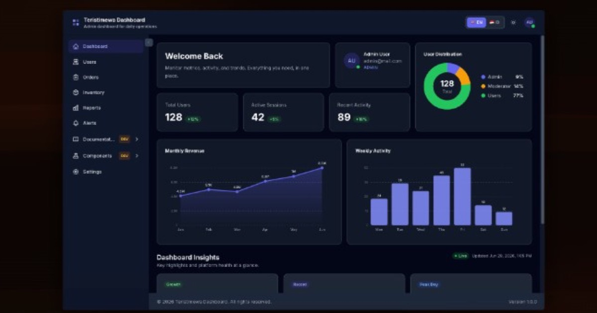

# React + TypeScript + Vite Application

**Production-ready React starter** with Vite, TypeScript, Tailwind CSS, and **Clean Layered Architecture**.

**Live template preview:** [https://template.teristimewa.com/react-dashboard-template-01](https://template.teristimewa.com/react-dashboard-template-01)

<a href="https://template.teristimewa.com/react-dashboard-template-01">
  
</a>

Choose Language / Pilih Bahasa:

- English (this document)
- [Bahasa Indonesia](./README.id.md)

---

## Table of Contents

1. [Prerequisites](#1-prerequisites)
2. [Installation & Getting Started](#2-installation--getting-started)
3. [Tech Stack & Architecture](#3-tech-stack--architecture)
4. [Project Structure](#4-project-structure)
5. [Development Commands](#5-development-commands)
6. [Routing & Auth](#6-routing--auth)
7. [Data Layer](#7-data-layer)
8. [i18n & Theming](#8-i18n--theming)
9. [UI Components](#9-ui-components)
10. [Deployment](#10-deployment)
11. [Makefile & Scaffolding](#11-makefile--scaffolding)
12. [Troubleshooting](#12-troubleshooting)

---

### 1. Prerequisites

This project pins **Node.js** and **pnpm** with [Volta](https://volta.sh) for consistent tooling across machines.

```json
"volta": {
  "node": "20.11.0",
  "pnpm": "8.15.4"
}
```

| Tool         | Version    | Role                                           |
| ------------ | ---------- | ---------------------------------------------- |
| **Node.js**  | `v20.11.0` | Runtime, build scripts, Vite dev server        |
| **pnpm**     | `v8.15.4`  | Dependency management and npm scripts          |
| **Git**      | latest     | Clone, branch, commit, `make generate`         |
| **GNU Make** | optional   | Dev shortcuts (`make dev`, `make build`, etc.) |
| **rsync**    | optional   | Required for `make generate` only              |

**Install Volta**

```bash
# macOS
brew install volta

# Linux / macOS (curl)
curl https://get.volta.sh | bash

# Windows
winget install Volta.Volta
```

After installation, restart your terminal and verify:

```bash
cd react-app
volta pin node@20.11.0
volta pin pnpm@8.15.4
node --version   # v20.11.0
pnpm --version   # 8.15.4
```

> **Windows note:** Use **WSL** for `make generate`. Native Windows does not include `rsync` by default.

---

### 2. Installation & Getting Started

```bash
git clone https://github.com/KutuGondrong/react-dashboard-template-01.git react-app
cd react-app
pnpm install
pnpm run dev
```

| Step         | Command            | Result                                    |
| ------------ | ------------------ | ----------------------------------------- |
| Install deps | `pnpm install`     | Resolves `pnpm-lock.yaml`                 |
| Dev server   | `pnpm run dev`     | Vite on `http://localhost:5173`           |
| Lint         | `pnpm run lint`    | ESLint + `tsc --noEmit`                   |
| Format       | `pnpm run format`  | Prettier + ESLint auto-fix                |
| Build        | `pnpm run build`   | Type-check → production bundle in `dist/` |
| Preview      | `pnpm run preview` | Serve `dist/` locally                     |

**Demo login:** `admin@mail.com` / `password123`

---

### 3. Tech Stack & Architecture

| Category | Package               | Version |
| -------- | --------------------- | ------- |
| UI       | `react` + `react-dom` | 18.3.1  |
| Language | `typescript`          | 5.7.2   |
| Bundler  | `vite`                | 5.4.11  |
| Styling  | `tailwindcss`         | 3.4.16  |
| HTTP     | `axios`               | 1.7.9   |
| Routing  | `react-router-dom`    | 6.28.0  |

**Clean Layered Architecture** with domain-driven `features/` modules:

```
Presentation   → pages, layouts, shared components
Application    → hooks, usecases, React context
Domain         → model types, mappers, payloads
Infrastructure → Axios, localStorage, config, router
```

**Data flow:** Page → Hook → Usecase → Repository → API Source → Axios

API responses are mapped via `model.map.ts` (snake_case JSON → camelCase UI types) before reaching components.

**Dependency rules:**

- Presentation may import Application, Domain, Infrastructure
- Application may import Domain, Infrastructure
- Domain must not import Presentation or Application

---

### 4. Project Structure

```
src/
├── config/           # App config, color tokens, base path
├── context/          # Auth, Locale, Theme, Scroll
├── router/           # Routes and guards
├── locales/          # en.json, id.json
├── models/           # API response, UI types, mappers
├── datasource/       # network (Axios) + local (localStorage)
├── components/       # Shared UI library (23+ components)
├── layouts/          # MainLayout, AuthLayout, Header, Sidebar
├── features/         # Domain modules (auth, users, dashboard, …)
└── utils/            # Pure helpers
```

**Path alias:** `@/*` → `src/*` (configured in `tsconfig.json` and `vite.config.ts`)

**Color tokens:** Use `src/config/color.tokens.ts` + `tailwind.config.js`. Do not hardcode hex values in components.

---

### 5. Development Commands

| Command                                            | Description                                    |
| -------------------------------------------------- | ---------------------------------------------- |
| `pnpm run dev` / `make dev`                        | Start Vite dev server (port 5173)              |
| `pnpm run lint` / `make lint`                      | ESLint + TypeScript check                      |
| `pnpm run format` / `make format`                  | Prettier + ESLint auto-fix                     |
| `pnpm run build` / `make build`                    | Format → type-check → production build         |
| `pnpm run preview` / `make preview`                | Serve `dist/` locally                          |
| `make clean`                                       | Remove `dist/`, `.turbo`, `node_modules/.vite` |
| `make generate name=my-app`                        | Scaffold micro-app outside this repo           |
| `make feature name=X label="Name" label-id="Nama"` | Scaffold sidebar menu + page                   |

**Pre-commit checklist:**

```bash
pnpm run format
pnpm run lint    # must be zero errors
pnpm run build   # recommended
```

---

### 6. Routing & Auth

| Path         | Layout     | Guard     | Page               |
| ------------ | ---------- | --------- | ------------------ |
| `/dashboard` | MainLayout | Protected | DashboardPage      |
| `/users`     | MainLayout | Protected | UsersPage          |
| `/settings`  | MainLayout | Protected | SettingsPage       |
| `/login`     | AuthLayout | Public    | LoginPage          |
| `/register`  | AuthLayout | Public    | RegisterPage       |
| `*`          | MainLayout | Protected | NotFoundPage (404) |

- **ProtectedRoute**: requires authentication; redirects to `/login`
- **PublicRoute**: guest only; redirects to `/dashboard` if logged in
- All pages use `React.lazy()` + `Suspense` for code splitting

---

### 7. Data Layer

Three network layers:

| Layer      | File                | Responsibility                         |
| ---------- | ------------------- | -------------------------------------- |
| Transport  | `backendService.ts` | Axios instance, interceptors, base URL |
| Endpoint   | `apiSource.ts`      | REST endpoint calls                    |
| Repository | `apiRepository.ts`  | Business logic, mock data, mappers     |

**Rules:**

- Do not call `axios` or `fetch` directly from components/hooks
- Do not use `localStorage` directly; use `localSource`
- Do not expose API snake_case fields in UI; use mappers

Mock auth (development): `admin@mail.com` / `password123` with ~800ms simulated delay.

---

### 8. i18n & Theming

**Supported locales:** `en` (English), `id` (Bahasa Indonesia)

```tsx
import { useLocale } from '@/context/LocaleContext';

const { t, locale, setLocale } = useLocale();
t('users.title');
t('users.deleteMessage', { name: 'John Doe' });
```

**Theme modes:** `light` · `dark` · `system` (via `useTheme()`)

Default locale: `'en'` in `app.config.ts`. Both locale and theme persist in localStorage.

---

### 9. UI Components

Shared components in `src/components/`, built with Tailwind and design tokens:

Button · Input · ComboBox · DataTable · Pagination · Modal · Drawer · Toast · Badge · Card · Avatar · Toggle · Typography · Chart · FileManagement · Layout · NavMenu · SkeletonLoader · ErrorBoundary · ScrollToTop · CodeBlock

Run `pnpm run dev` and open **Components** (DEV badge) for the in-app catalog and playground.

---

### 10. Deployment

| Variable                 | Default      | Purpose                                               |
| ------------------------ | ------------ | ----------------------------------------------------- |
| `VITE_API_BASE_URL`      | `/api`       | Backend API base URL                                  |
| `VITE_BASE_PATH`         | `/`          | Subpath deploy (e.g. `/react-dashboard-template-01/`) |
| `VITE_SHOW_DEV_FEATURES` | `true` (dev) | Show Tutorial & Storybook                             |

Set `previewUrl` in `src/config/external-links.json` (or `VITE_OG_SITE_URL` in `.env.production`) to your deployed app URL so link previews use `public/og-image.jpg`.

Set `VITE_BASE_PATH` before `pnpm run build` when the app is served under a subpath (not domain root). The `dist/` output must be served with **SPA fallback** so deep links (e.g. `/dashboard`) resolve to `index.html`. Configure fallback in your hosting provider's docs.

```bash
pnpm run build
pnpm run preview   # optional, verify dist/ locally
```

For deeper deployment notes, see [DOCUMENTATION.md](./DOCUMENTATION.md) and [DOCUMENTATION.id.md](./DOCUMENTATION.id.md).

---

### 11. Makefile & Scaffolding

**Scaffold a feature:**

```bash
make feature name=reports label="Reports" label-id="Laporan"
```

**Scaffold a micro-app:**

```bash
make generate name=my-new-app
make generate name=my-new-app out=~/projects/my-new-app
```

---

### 12. Troubleshooting

| Issue                            | Fix                                                                              |
| -------------------------------- | -------------------------------------------------------------------------------- |
| `node_modules not found`         | Run `pnpm install`                                                               |
| Wrong Node version               | `volta pin node@20.11.0 && volta pin pnpm@8.15.4`, restart terminal              |
| `pnpm: command not found`        | `volta install pnpm@8.15.4`                                                      |
| ESLint `no-explicit-any`         | Replace `any` with a specific type or `unknown`                                  |
| Blank page after subpath deploy  | Match `VITE_BASE_PATH` with your hosting path; enable SPA fallback on the server |
| `make generate` fails on Windows | Use WSL (requires `rsync`)                                                       |
| Login not working                | Use demo credentials; clear localStorage in DevTools                             |

---

### Further Reading

- [README.id.md](./README.id.md): full documentation in Bahasa Indonesia
- [DOCUMENTATION.md](./DOCUMENTATION.md): deep developer documentation (English)
- [DOCUMENTATION.id.md](./DOCUMENTATION.id.md): deep developer documentation (Bahasa Indonesia)
- In-app **Tutorial** (DEV badge) during `pnpm run dev`, links to published docs
